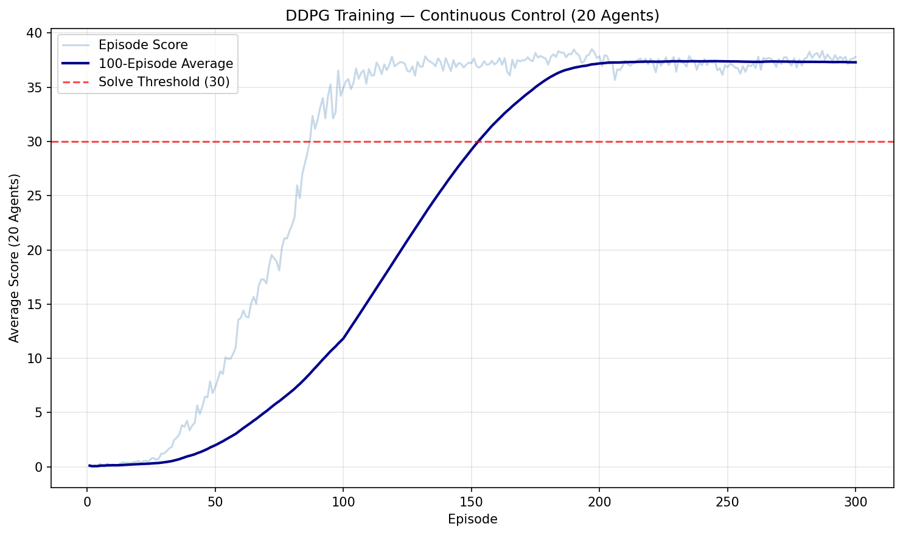

# Project Report — Continuous Control

## Learning Algorithm

This project implements **DDPG (Deep Deterministic Policy Gradients)** (Lillicrap et al., 2016) with 20 parallel agents sharing a single replay buffer and set of networks.

### DDPG Overview

DDPG is an actor-critic algorithm designed for continuous action spaces. It combines ideas from DPG (Deterministic Policy Gradient) and DQN:

- **Actor network** μ(s|θ^μ): Learns a deterministic policy that maps states directly to continuous actions.
- **Critic network** Q(s,a|θ^Q): Learns to evaluate state-action pairs, providing the gradient signal for the actor.

The actor is updated by applying the chain rule to the expected return from the start distribution, using the critic's gradient:

```
∇_θμ J ≈ E[ ∇_a Q(s,a|θ^Q)|a=μ(s) · ∇_θμ μ(s|θ^μ) ]
```

### Target Networks

Like DQN, DDPG uses target networks for both the actor and critic to stabilize learning. Instead of hard copies, it uses **soft updates**:

```
θ_target = τ · θ_local + (1 - τ) · θ_target
```

with τ = 0.001, blending 0.1% of the local weights into the target at each learning step. This prevents the target from changing too rapidly, which would destabilize the critic's Q-value estimates.

### Experience Replay

All 20 agents share a single replay buffer of 1,000,000 transitions. Random sampling from this buffer breaks temporal correlations and ensures diverse training batches. With 20 agents contributing simultaneously, the buffer fills 20x faster than single-agent DDPG, providing better coverage of the state-action space.

### Ornstein-Uhlenbeck Noise

For exploration, DDPG adds temporally correlated noise from an Ornstein-Uhlenbeck process to the actor's deterministic output:

```
dx = θ(μ - x)dt + σdW
```

This produces smooth, momentum-like exploration trajectories that are better suited to physical control tasks than independent Gaussian noise at each timestep.

## Multi-Agent Training

The 20-agent version of the Reacher environment runs 20 identical arms in parallel. All agents share:

- **One actor network** (and its target) — the same policy controls all arms
- **One critic network** (and its target) — a single value function for the shared state-action space
- **One replay buffer** — experiences from all agents are pooled together

At each timestep, all 20 agents observe their states, take actions through the shared actor, and contribute their transitions to the shared buffer. This effectively provides 20x the experience per episode, significantly accelerating learning compared to a single agent.

**Learning schedule**: Rather than updating after every timestep (which would be wasteful and unstable with 20 agents producing transitions), we learn every 20 timesteps with 10 gradient updates per learning event. This batch-learning approach collects 400 transitions between updates, then performs concentrated learning, balancing sample efficiency with training stability.

## Network Architecture

### Actor

```
Input (33) → FC1 (256, BatchNorm, ReLU) → FC2 (256, BatchNorm, ReLU) → FC3 (4, Tanh)
```

| Layer | Parameters |
|---|---|
| FC1: 33 → 256 | 8,704 |
| BatchNorm1 | 512 |
| FC2: 256 → 256 | 65,792 |
| BatchNorm2 | 512 |
| FC3: 256 → 4 | 1,028 |
| **Total** | **76,548** |

BatchNorm normalizes activations after each hidden layer. The 33-dimensional state contains physical quantities with different units (positions, velocities, angles), and BatchNorm helps the network handle these varying scales. The final Tanh activation constrains actions to [-1, 1].

### Critic

```
Input (33) → FC1 (256, BatchNorm, ReLU) → [concat action (4)] → FC2 (260→256, ReLU) → FC3 (256→128, ReLU) → FC4 (128→1)
```

| Layer | Parameters |
|---|---|
| FC1: 33 → 256 | 8,704 |
| BatchNorm1 | 512 |
| FC2: 260 → 256 | 66,816 |
| FC3: 256 → 128 | 32,896 |
| FC4: 128 → 1 | 129 |
| **Total** | **109,057** |

Actions are injected after the first hidden layer, as recommended in the DDPG paper. This allows the first layer to learn a good state representation before incorporating the action. BatchNorm is applied only on the state path (before action concatenation). The critic is deeper (4 layers vs 3 in the pendulum reference) to handle the more complex Reacher dynamics.

**Weight initialization**: Hidden layers use fan-in uniform initialization (±1/√fan_in). Output layers use uniform(-3e-3, 3e-3) to ensure initial outputs are near zero.

## Hyperparameters

| Parameter | Value | Rationale |
|---|---|---|
| Replay buffer size | 1,000,000 | Large buffer for 20 agents generating 20x experience |
| Batch size | 256 | Larger than standard 128 for stability with many agents |
| Discount factor (γ) | 0.99 | Standard, values future rewards highly |
| Soft update rate (τ) | 0.001 | Slow blending for target network stability |
| Actor learning rate | 1e-4 | Standard DDPG, Adam optimizer |
| Critic learning rate | 1e-3 | 10x actor LR (standard DDPG practice) |
| Weight decay | 0 | No L2 regularization needed |
| Learn every | 20 steps | With 20 agents, avoids excessive updates per timestep |
| Num updates | 10 | Concentrated learning when we do update |
| OU θ | 0.15 | Standard mean-reversion rate |
| OU σ | 0.2 | Standard noise scale |
| Gradient clipping | 1.0 | Clips critic gradients to stabilize training |

## Plot of Rewards



The plot shows the average score across all 20 agents per episode (light) and the 100-episode rolling average (dark). The environment was **solved at episode 157**, when the 100-episode rolling average first exceeded 30.0 (reaching 30.06). Training continued to 300 episodes, where the rolling average plateaued at approximately **37.1**.

**Training dynamics**: Scores start near 0.7 (random policy) and remain flat through episode ~25 as the replay buffer fills. Learning accelerates rapidly from episodes 30–100, with individual episode scores climbing from ~5 to ~30. By episode 100, most episodes score above 30. The rolling average crosses the solve threshold at episode 157 and stabilizes around 37 by episode 230.

**Greedy evaluation**: After training, the saved checkpoint weights were loaded and tested over 100 episodes with no exploration noise. The agent achieved an average score of **38.89** (σ = 0.19, min = 38.24, max = 39.29), confirming robust performance well above the 30.0 solve condition. The remarkably low standard deviation indicates highly consistent policy execution.

## Ideas for Future Work

1. **PPO (Proximal Policy Optimization)**: PPO is often more stable than DDPG for continuous control and requires less hyperparameter tuning. It uses a clipped surrogate objective to prevent destructively large policy updates, making it a strong alternative for the Reacher task.

2. **TD3 (Twin Delayed DDPG)** (Fujimoto et al., 2018): Addresses DDPG's overestimation bias with three techniques: twin critics (take the minimum Q-value), delayed policy updates, and target policy smoothing. These changes consistently improve performance over standard DDPG.

3. **D4PG (Distributed Distributional DDPG)** (Barth-Maron et al., 2018): Combines DDPG with distributional value estimation, N-step returns, and prioritized experience replay. The distributional critic models the full return distribution rather than just the mean, providing richer gradient information.

4. **Prioritized Experience Replay** (Schaul et al., 2016): Currently we sample uniformly from the buffer. Prioritizing transitions with high TD error would focus learning on the most informative experiences, potentially accelerating convergence.

5. **Parameter Space Noise** (Plappert et al., 2018): Instead of adding noise to actions (OU process), add noise directly to the network parameters. This provides state-dependent exploration — the agent explores more in novel states and less in familiar ones, often outperforming action-space noise.
